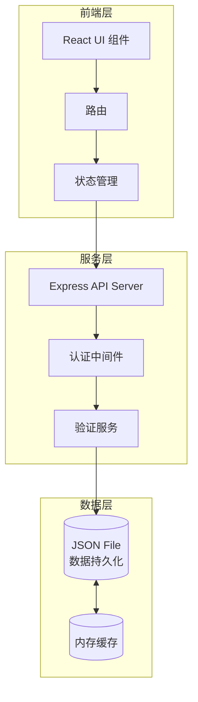

# 稿件更正与发布审批工作台 - 技术架构文档

## 1. 架构设计



## 2. 技术栈

| 层级 | 技术 | 版本 |
|------|------|------|
| 前端框架 | React | 18.x |
| 构建工具 | Vite | 5.x |
| 样式方案 | Tailwind CSS | 3.x |
| 路由 | React Router | 6.x |
| 状态管理 | Zustand | 4.x |
| 后端框架 | Express | 4.x |
| 数据存储 | JSON 文件 | - |
| 导出库 | SheetJS (xlsx) | 0.20.x |

## 3. 目录结构

```
zyx-00103/
├── src/
│   ├── components/          # 公共组件
│   │   ├── Layout/
│   │   ├── Button/
│   │   ├── Table/
│   │   └── Modal/
│   ├── pages/               # 页面
│   │   ├── Login/
│   │   ├── Dashboard/
│   │   ├── Manuscripts/
│   │   ├── Corrections/
│   │   └── History/
│   ├── services/            # API 服务
│   ├── stores/              # Zustand 状态
│   ├── utils/               # 工具函数
│   └── styles/              # 全局样式
├── server/
│   ├── routes/              # 路由
│   ├── middleware/          # 中间件
│   ├── services/            # 业务逻辑
│   ├── data/                # JSON 数据文件
│   └── index.js             # 服务入口
├── public/
├── package.json
└── vite.config.js
```

## 4. 路由定义

| 路由 | 页面 | 权限 |
|------|------|------|
| / | 登录页 | 公开 |
| /dashboard | 工作台 | 所有角色 |
| /manuscripts | 稿件列表 | 所有角色 |
| /manuscripts/:id | 稿件详情 | 所有角色 |
| /manuscripts/new | 创建稿件 | 记者 |
| /corrections | 更正单列表 | 所有角色 |
| /corrections/new | 创建更正单 | 记者 |
| /corrections/:id | 更正单详情 | 所有角色 |
| /history | 操作历史 | 所有角色 |
| /settings | 配置管理 | 管理员 |

## 5. 数据模型

### 5.1 用户模型

```typescript
interface User {
  id: string;
  username: string;
  password: string; // 加密存储
  role: 'journalist' | 'editor' | 'legal' | 'admin';
  displayName: string;
  createdAt: string;
}
```

### 5.2 稿件模型

```typescript
interface Manuscript {
  id: string;
  title: string;
  content: string;
  authorId: string;
  authorName: string;
  status: 'draft' | 'published';
  publishedAt: string | null;
  createdAt: string;
  updatedAt: string;
}
```

### 5.3 更正单模型

```typescript
interface Correction {
  id: string;
  manuscriptId: string;
  manuscriptTitle: string;
  type: 'factual_error' | 'title_error' | 'source_correction' | 'content_addition' | 'other';
  evidence: string;
  deadline: string;
  impactScope: string;
  hasSourceDispute: boolean;
  status: 'draft' | 'pending_editor' | 'pending_legal' | 'pending_publish' | 'published' | 'rejected';
  creatorId: string;
  creatorName: string;
  currentHandlerId: string | null;
  createdAt: string;
  updatedAt: string;
}
```

### 5.4 历史记录模型

```typescript
interface HistoryRecord {
  id: string;
  correctionId: string;
  action: 'create' | 'submit' | 'review_pass' | 'review_reject' | 'legal_confirm' | 'legal_reject' | 'publish' | 'revoke';
  operatorId: string;
  operatorName: string;
  operatorRole: string;
  comment: string;
  previousStatus: string;
  newStatus: string;
  createdAt: string;
}
```

### 5.5 筛选配置模型

```typescript
interface FilterConfig {
  id: string;
  name: string;
  filters: {
    status?: string[];
    type?: string[];
    dateRange?: { start: string; end: string };
    manuscriptId?: string;
  };
  createdBy: string;
  createdAt: string;
}
```

## 6. API 定义

### 6.1 认证接口

| 方法 | 路径 | 描述 |
|------|------|------|
| POST | /api/auth/login | 用户登录 |
| GET | /api/auth/me | 获取当前用户 |

### 6.2 稿件接口

| 方法 | 路径 | 描述 |
|------|------|------|
| GET | /api/manuscripts | 获取稿件列表 |
| GET | /api/manuscripts/:id | 获取稿件详情 |
| POST | /api/manuscripts | 创建稿件 |
| PUT | /api/manuscripts/:id | 更新稿件 |
| DELETE | /api/manuscripts/:id | 删除稿件 |

### 6.3 更正单接口

| 方法 | 路径 | 描述 |
|------|------|------|
| GET | /api/corrections | 获取更正单列表 |
| GET | /api/corrections/:id | 获取更正单详情 |
| POST | /api/corrections | 创建更正单 |
| PUT | /api/corrections/:id | 更新更正单 |
| POST | /api/corrections/:id/submit | 提交更正单 |
| POST | /api/corrections/:id/review | 编辑复核 |
| POST | /api/corrections/:id/legal | 法务确认 |
| POST | /api/corrections/:id/publish | 发布更正 |
| POST | /api/corrections/:id/revoke | 撤销更正 |

### 6.4 历史接口

| 方法 | 路径 | 描述 |
|------|------|------|
| GET | /api/history | 获取操作历史 |

### 6.5 导出接口

| 方法 | 路径 | 描述 |
|------|------|------|
| GET | /api/export/json | 导出 JSON |
| GET | /api/export/csv | 导出 CSV |

### 6.6 配置接口

| 方法 | 路径 | 描述 |
|------|------|------|
| GET | /api/configs | 获取筛选配置 |
| POST | /api/configs | 创建筛选配置 |
| DELETE | /api/configs/:id | 删除筛选配置 |

## 7. 服务架构


## 8. 验证规则

### 8.1 必填字段验证

```javascript
const requiredFields = {
  correction: ['manuscriptId', 'type', 'evidence', 'deadline', 'impactScope'],
  review: ['comment']
};
```

### 8.2 权限验证矩阵

| 操作 | 记者 | 编辑 | 法务 | 管理员 |
|------|------|------|------|--------|
| 创建稿件 | ✓ | ✗ | ✗ | ✗ |
| 创建更正单 | ✓ | ✗ | ✗ | ✗ |
| 提交更正单 | ✓ | ✗ | ✗ | ✗ |
| 编辑复核 | ✗ | ✓ | ✗ | ✗ |
| 法务确认 | ✗ | ✗ | ✓ | ✗ |
| 发布更正 | ✗ | ✗ | ✗ | ✓ |
| 撤销更正 | ✗ | ✗ | ✗ | ✓ |
| 导出数据 | ✗ | ✗ | ✗ | ✓ |

### 8.3 状态转换验证

| 当前状态 | 允许操作 | 目标状态 |
|----------|----------|----------|
| draft | submit | pending_editor |
| pending_editor | review_pass | pending_legal |
| pending_editor | review_reject | rejected |
| pending_legal | legal_confirm | pending_publish |
| pending_legal | legal_reject | rejected |
| pending_publish | publish | published |
| pending_publish | legal_reject | rejected |
| published | revoke | pending_publish |

## 9. 数据持久化

### 9.1 存储位置
- `server/data/manuscripts.json` - 稿件数据
- `server/data/corrections.json` - 更正单数据
- `server/data/history.json` - 历史记录
- `server/data/configs.json` - 筛选配置
- `server/data/users.json` - 用户数据

### 9.2 初始化数据
启动时自动加载 JSON 文件，如不存在则创建空数组。
关键操作（创建、更新、删除）自动同步写入文件。

## 10. 错误响应格式

```typescript
interface ErrorResponse {
  success: false;
  error: {
    code: string;
    message: string;
    details?: any;
  };
}
```

### 错误码定义

| 错误码 | 描述 |
|--------|------|
| VALIDATION_ERROR | 验证失败 |
| UNAUTHORIZED | 未登录 |
| FORBIDDEN | 无权限 |
| NOT_FOUND | 资源不存在 |
| INVALID_STATUS | 状态不允许 |
| DUPLICATE_PUBLISH | 重复发布 |
| SOURCE_DISPUTE | 来源争议未处理 |
